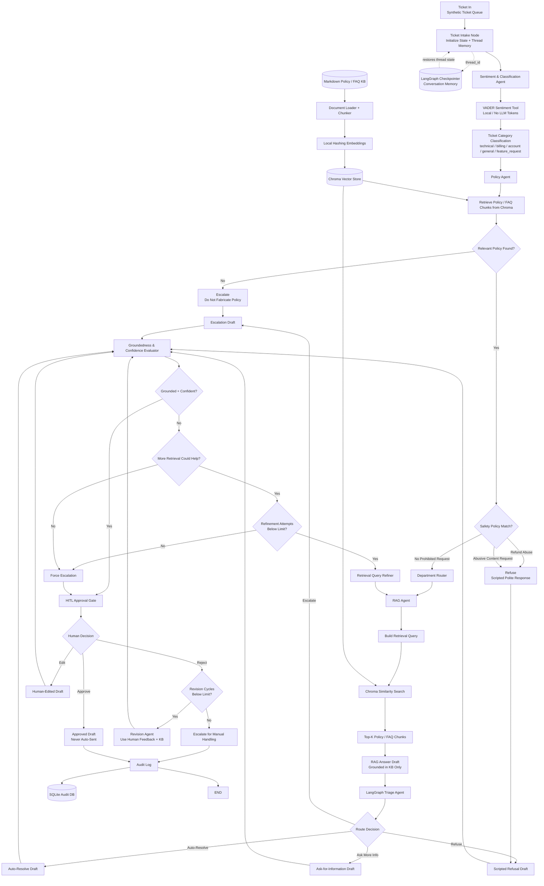
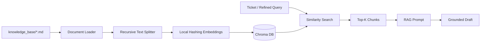
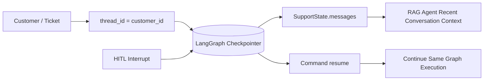

# Intelligent Support System — LangGraph Flow



## End-to-End Flow

```text
Ticket In
   ↓
Ticket Intake + Thread Memory
   ↓
VADER Sentiment Tool
   ↓
Ticket Classification
   ↓
Policy Check
   ↓
RAG Retrieval + Draft
   ↓
LangGraph Route Decision
   ├── Auto-Resolve
   ├── Escalate
   ├── Refuse
   └── Ask More Information
   ↓
Groundedness / Confidence Check
   ├── PASS → HITL
   └── FAIL
         ↓
      Retrieval Refinement
         ↓
      RAG Again
         ↓
      Confidence Re-check
         ↓
      Force Escalation if retry limit reached
   ↓
Human Approval
   ├── Approve → Audit
   ├── Edit → Grounding Re-check → HITL
   └── Reject → Revision → Grounding Re-check → HITL
   ↓
SQLite Audit Log
   ↓
END
```

## Safety Mapping

| Condition | Action |
|---|---|
| Relevant policy/FAQ is not found | Escalate rather than fabricate |
| Refund-abuse request is supported by refund policy | Refuse with scripted response |
| Abusive-content request is supported by abusive-content policy | Refuse with scripted response |
| Ticket needs non-sensitive information | Ask for more information |
| KB fully supports resolution | Auto-resolve candidate |
| Groundedness/confidence is too low | Refine retrieval |
| Retrieval refinement limit is reached | Force escalation |
| Any customer-facing reply | Draft only; never auto-sent |
| Human edits a draft | Re-run groundedness evaluation |
| Human rejects a draft | Revise using feedback, then re-evaluate |
| Final human decision | Write an idempotent audit event |

## RAG Flow



## Memory Flow



## Main LangGraph Nodes

```text
START
  ↓
ticket_in
  ↓
sentiment_and_classification
  ↓
policy_check
  ↓
department_router
  ↓
rag_answer_draft
  ↓
route_decision
  ├─ auto_resolve
  ├─ escalate
  ├─ refuse
  └─ ask_more_info
       ↓
groundedness_evaluator
  ├─ hitl_approval
  ├─ refine_retrieval ─────→ rag_answer_draft
  └─ force_escalation ─────→ hitl_approval

hitl_approval
  ├─ approve ───────────────→ audit_log
  ├─ edit ──────────────────→ groundedness_evaluator
  └─ reject ────────────────→ revise_response
                                  ↓
                           groundedness_evaluator

audit_log
  ↓
END
```